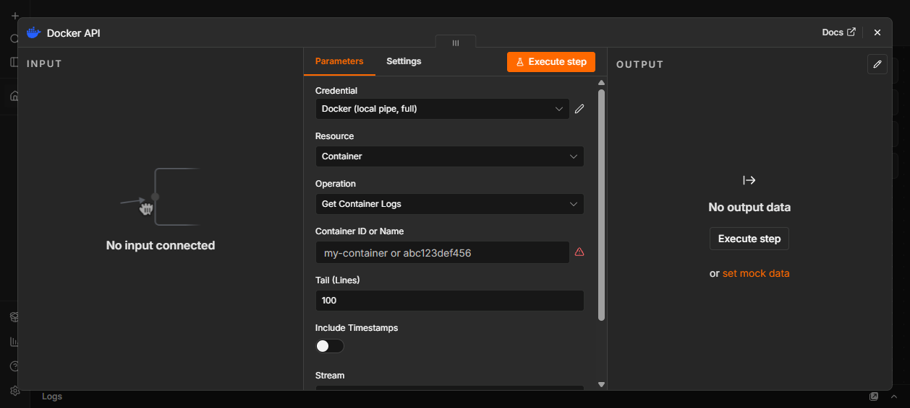
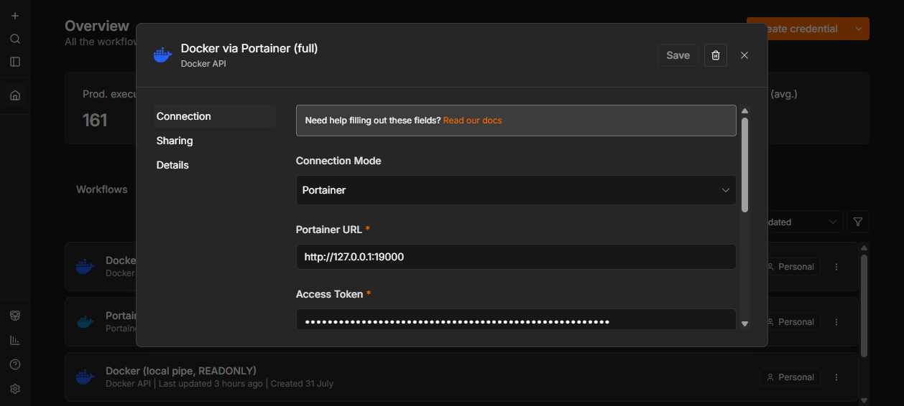
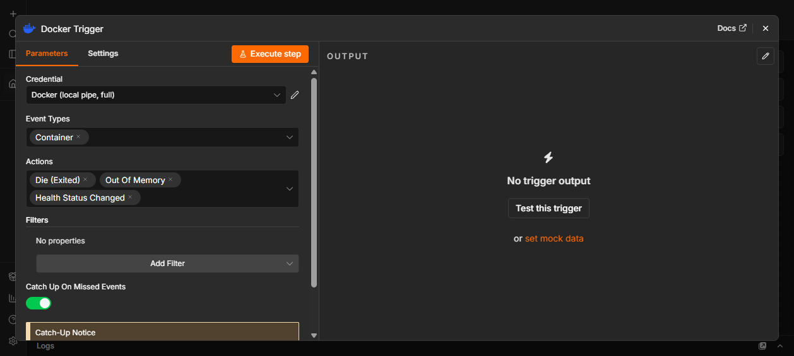

# 🐳 n8n-nodes-docker-api

[](https://www.npmjs.com/package/n8n-nodes-docker-api)
[](https://www.npmjs.com/package/n8n-nodes-docker-api)
[](https://docs.n8n.io/integrations/community-nodes/)
[](https://opensource.org/licenses/MIT)

> Control Docker from your n8n workflows — 48 operations plus an event trigger,
> with output you can feed straight into an IF node.

---

## Why this node

**No dependencies.** Talks to the Docker Engine API directly over a socket, TCP
or TLS. If you already run Portainer, it can go through that too — but nothing
extra is required.

**Output you can actually use.** Docker's raw responses are verbose, deeply
nested, and inconsistent between endpoints. Everything here is normalized to a
flat, stable shape, and the *same* container looks the same whichever operation
returned it.

```jsonc
// List Containers — one item
{
  "id": "e324df4bd041772cc01172d392a4c2faa87d63614b8c0d0ab859919cb9a84432",
  "shortId": "e324df4bd041",
  "name": "api-gateway",
  "image": "nginx:alpine",
  "status": "running",
  "createdAt": "2026-07-31T13:45:48.000Z",
  "ports": [{ "containerPort": 80, "hostPort": 8080, "protocol": "tcp" }],
  "labels": { "com.example.tier": "edge" }
}
```

**Safe by default.** Credentials carry an access mode, enforced at run time — not
just hidden in the UI. Every destructive operation offers a dry run, and every
prune shows you exactly what it would remove first.

**It tells you when it doesn't know.** An empty result always says whether it
means *nothing found* or *not looked up*. Operations that cannot return complete
information say so in the output rather than returning a confident half-answer.

---

## Install

**Community Nodes (recommended)**

Settings → Community Nodes → Install → `n8n-nodes-docker-api`

**Manual**

```bash
npm install n8n-nodes-docker-api
```

Requires a self-hosted n8n with access to a Docker daemon.

---

## Quick start

1. Add a **Docker API** credential and pick a connection mode
2. Press **Test Connection** — it reports the daemon version on success
3. Add the **Docker API** node, choose a resource and operation



---

## Connecting

| Mode | Use when |
|---|---|
| **Unix Socket / Named Pipe** | Docker runs on the same machine as n8n |
| **TCP** | Remote daemon on a trusted private network |
| **TLS** | Remote daemon, encrypted with client certificates |
| **Portainer** | You already run Portainer and want to go through it |

The socket path defaults correctly for the host n8n is running on —
`/var/run/docker.sock` on Linux and macOS, `//./pipe/docker_engine` on Windows.



### Access modes

Set on the credential and enforced at run time:

- **Read Only** — listing, inspection, logs, stats. Write operations are refused
  with a clear message.
- **Full Control** — everything.

Unrecognised operations are denied under Read Only rather than allowed, so a
future addition can never quietly widen what a read-only credential can do.

---

## Operations

### Containers (21)

| | |
|---|---|
| **Read** | List · Inspect · Get Logs · List Processes · Get Filesystem Changes · Get Stats |
| **Lifecycle** | Create · Start · Stop · Restart · Kill · Pause · Unpause · Rename · Remove · Prune |
| **Beyond the API** | Run (Ephemeral) · Execute Command · Wait For State · Copy From · Copy To |

**Run Container (Ephemeral)** creates, runs, captures output and removes — in one
step. The container is cleaned up on every path, including timeout, so a workflow
that fails midway never leaves one behind.

**Execute Command** returns `{ stdout, stderr, exitCode }` from a single
operation, with the two streams kept separate.

**Wait For State** blocks until a container is `running`, `healthy` or `exited`.
Waiting on *healthy* is the piece every deploy-then-verify workflow needs, and
Docker has no endpoint for it.

**Get Logs** returns structured lines with their stream of origin:

```jsonc
{ "logs": [ { "message": "listening on :8080", "stream": "stdout" },
            { "message": "upstream timeout",   "stream": "stderr" } ],
  "lineCount": 2, "tty": false }
```

**Get Stats** returns numbers people actually want — `cpuPercent`,
`memoryUsageMB`, `memoryPercent`, `networkRxMB` — rather than Docker's raw
cumulative counters.

**Copy From / To Container** moves files through n8n's binary data system, so
they can be written to disk, uploaded, or attached like any other file.

### Images (9)

List · Inspect · Get History · Search · Pull · Push · Tag · Remove · Prune

Pull and Push wait for completion and return a summary — layers, digest, status,
duration — instead of a progress firehose or a stream that never ends.

### Networks (7)

List · Inspect · Create · Connect Container · Disconnect Container · Remove · Prune

### Volumes (5)

List · Inspect · Create · Remove · Prune

### System (5)

Get Info · Get Version · Ping · Get Disk Usage · Get Events

### Custom API Call

An escape hatch to any Docker Engine endpoint, for anything not covered above or
a newer API than this release knows about. The response comes back exactly as
Docker sent it and is marked `normalized: false` — the one operation that
deliberately does not promise a stable shape.

---

## Docker Trigger

Start a workflow when something happens in Docker.



Watches containers, images, networks, volumes and the daemon. Filter by event
type, action, container, image or label — filters are applied by Docker, so only
matching events are sent.

**It catches up.** Docker's event stream is live-only: connect, and you get what
happens next and nothing earlier. If n8n restarts, a naive listener silently
loses everything that happened in between — which is exactly when something worth
knowing about tends to occur. This trigger remembers where it got to and replays
from there, without ever delivering the same event twice.

**It reconnects.** Event streams die for ordinary reasons — daemon restarts,
socket hiccups, a laptop sleeping. It reconnects with backoff rather than quietly
stopping.

---

## Example workflows

**Restart a service when it dies**

```
Docker Trigger (container · die)  →  IF (name = api-gateway)  →  Docker: Start Container
```

**Alert on unhealthy containers**

```
Docker Trigger (container · health_status)  →  IF (health = unhealthy)  →  Slack
```

**Run a job in an isolated container**

```
Schedule  →  Docker: Run Container (Ephemeral)  →  IF (exitCode = 0)  →  …
```

Nothing is left behind — the container is removed even if the command fails or
times out.

**Nightly disk report**

```
Schedule  →  Docker: Get Disk Usage  →  Docker: Prune Images (Dry Run)  →  Email
```

The dry run reports what *would* be reclaimed, so the report is informative
without being destructive.

---

## Security

Access to the Docker daemon is equivalent to root on the host. That is true of
any tool that talks to Docker, and worth stating plainly.

- Use **Read Only** credentials unless a workflow genuinely needs to change things
- Prefer **TLS** over plain TCP for anything crossing a network
- Consider a socket proxy such as `tecnativa/docker-socket-proxy` to restrict
  which endpoints are reachable at all
- Never expose the Docker daemon on a public interface

The credential UI carries this warning too, and Read Only is the default.

---

## Scope

This node covers containers, images, networks, volumes and system operations —
the surface that automation workflows actually use.

**Swarm mode** (services, nodes, tasks, secrets, configs) and **plugin
management** are deliberately out of scope. Teams running Swarm manage it with
Swarm-native tooling rather than from workflow steps, and supporting it well
would mean a large surface serving very few n8n users. Anything genuinely needed
remains reachable through **Custom API Call**.

---

## Contributing

Issues and pull requests are welcome — particularly bug reports with a
reproducible workflow. See [DEVELOPMENT.md](./DEVELOPMENT.md) for the local
setup and test harness.

## License

[MIT](./LICENSE)
